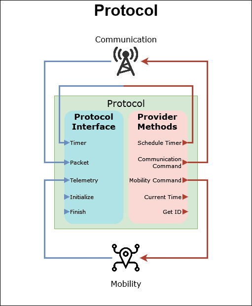
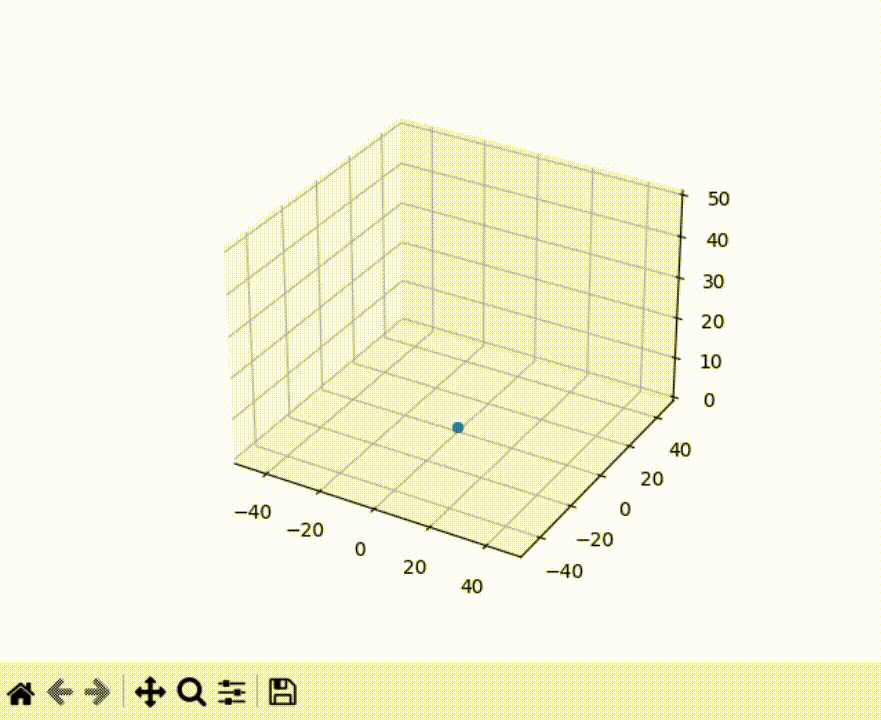

# Usage

## Understanding a protocol

Protocols are classes that implements your algorithms main logic. The class is
called protocol because it defines the behaviour protocol of the node. If you
are satisfied with the simulation environment provided ready to use by
**GrADyS-SIM TNG**, this is the only class you need to code. You can use your
protocol on any simulation environment. We will be
using [prototype mode][prototype-mode]
to run a protocol within a python environment.

Before building a protocol it is important to have a basic idea of what you are
building. Protocols are classes that implement node behaviour on an event based
environment. Event based means that you will program your logic in a reactive
way. In other words the program's execution flow will only run code within your
class when something happens to the node whose logic you are programming. This
"something" can be a timer firing, a message being received or some information
about your mobility being transferred to it. This is very similar to how user
interfaces are build, they lay idle and react to user inputs.



Protocols have to inherit from the `IProtocol` class and implement the protocol
interface this base class defines. These methods are called to react to some
event relevant to the network node hosting your protocol. The logic of your
protocol is implemented in these reactions.

The protocol class itself does not handle communication or mobility, these are
handled externally. Think of the protocol as the brains of the operation,
issuing commands to these external modules that actually perform the actions.

In order to issue these commands they have use to a set of methods accessible
through a `IProvider` instance which is available through `self.provider`
defined in the protocol base class. These methods are how the protocol interacts
with its environment. Methods are available to send messages, move to specific
places, schedule timers and more.

## Building our first protocol

``` py title="counter_protocol.py"
--8<-- "docs/Getting Started/counter example/1/counter_protocol.py"
```

The protocol above is very simple. All it does is use the _provider_ methods
available to the protocol to schedule a timer that fires every second. When this
timer fires the protocol increments a counter and sets the timer again.

Now that we have created a protocol, we just have to execute it. As mentioned we
will be using [prototype mode](execution.md#prototype-mode) for this example. Creating a simulation is 
preferably done through the [SimulationBuilder][gradysim.simulator.simulation.SimulationBuilder] 
class. This class presents a simple API for instantiating python simulations.

``` py title="counter_execution.py"
--8<-- "docs/Getting Started/counter example/1/counter_execution.py"
```

Running the file above we will notice the following output on our terminal:

``` title="Console output"
INFO     [--------- Simulation started ---------]
INFO     [--------- Simulation finished ---------]
INFO     [it=0 time=0:00:00 | Node 0 Finalization] Final counter value: 10
INFO     Real time elapsed: 0:00:00.000195      Total iterations: 10    Simulation time: 0:00:10
```

We can see that the simulation ran for 10 simulation seconds which took 0.000195
real-world seconds to execute. In that time we ran 10 simulation iterations. 
Remember that our CounterProtocol sets a timer for every second, so the number 
of iterations is expected. What is also expected is the "Final counter value" 
logged, which is 10.

## Adding Communication

The last example, while useful to demonstrate how a protocol is the class that
implements your logic in an event-based manner, didn't demonstrate one of the
main features of the simulator: communication. One of the biggest challenges
of building distributed systems is that they rely on asynchronous communication
to share information between nodes.

GrADyS-SIM TNG will help you build these kinds of systems by providing support
for communication between network nodes. Nodes share messages with each other by
using communication commands that instruct their mobility modules to perform
actions
like broadcasting a message, sending one to a specific node or others.

``` py title="counter_protocol.py"
--8<-- "docs/Getting Started/counter example/2/counter_protocol.py"
```

To demonstrate communication we are now creating a simulation populated by 
several network nodes. All of these nodes are periodically sending messages to 
all the other ones. Each node keeps track of how many messages it has received 
and sent. The result of executing this protocol is the following:

``` py title="counter_execution.py"
--8<-- "docs/Getting Started/counter example/2/counter_execution.py"
```

``` title="Console output"
INFO     [--------- Simulation started ---------]
INFO     [--------- Simulation finished ---------]
INFO     [it=0 time=0:00:00 | Node 0 Finalization] Final counter values: sent=10 ; received=90
INFO     [it=0 time=0:00:00 | Node 1 Finalization] Final counter values: sent=10 ; received=90
INFO     [it=0 time=0:00:00 | Node 2 Finalization] Final counter values: sent=10 ; received=90
INFO     [it=0 time=0:00:00 | Node 3 Finalization] Final counter values: sent=10 ; received=90
INFO     [it=0 time=0:00:00 | Node 4 Finalization] Final counter values: sent=10 ; received=90
INFO     [it=0 time=0:00:00 | Node 5 Finalization] Final counter values: sent=10 ; received=90
INFO     [it=0 time=0:00:00 | Node 6 Finalization] Final counter values: sent=10 ; received=90
INFO     [it=0 time=0:00:00 | Node 7 Finalization] Final counter values: sent=10 ; received=90
INFO     [it=0 time=0:00:00 | Node 8 Finalization] Final counter values: sent=10 ; received=90
INFO     [it=0 time=0:00:00 | Node 9 Finalization] Final counter values: sent=10 ; received=90
INFO     Real time elapsed: 0:00:00.004000	Total iterations: 1000	Simulation time: 0:00:10

Process finished with exit code 0
```

We can see that every node's timer fired 10 times, as expected from our last
protocol. The interesting part is seeing that each node received 90 messages, 1 
from every node other then itself 10 times.

## Configuring the communication medium

An important part of developing distributed systems is thinking about 
resiliency. A lot of times communication is flawed and messages fail to reach 
their destination. In order to enable developers to validate their protocols the
**communication handler**is configurable to enable certain restrictions to 
communication, like adding delay, limiting the range of communication and adding 
failures.

``` py title="counter_execution.py"
--8<-- "docs/Getting Started/counter example/3/counter_execution.py"
```

``` title="Console output"
INFO     [--------- Simulation started ---------]
INFO     [--------- Simulation finished ---------]
INFO     [it=0 time=0:00:00 | Node 0 Finalization] Final counter values: sent=100 ; received=434
INFO     [it=0 time=0:00:00 | Node 1 Finalization] Final counter values: sent=100 ; received=442
INFO     [it=0 time=0:00:00 | Node 2 Finalization] Final counter values: sent=100 ; received=476
INFO     [it=0 time=0:00:00 | Node 3 Finalization] Final counter values: sent=100 ; received=446
INFO     [it=0 time=0:00:00 | Node 4 Finalization] Final counter values: sent=100 ; received=430
INFO     [it=0 time=0:00:00 | Node 5 Finalization] Final counter values: sent=100 ; received=450
INFO     [it=0 time=0:00:00 | Node 6 Finalization] Final counter values: sent=100 ; received=444
INFO     [it=0 time=0:00:00 | Node 7 Finalization] Final counter values: sent=100 ; received=438
INFO     [it=0 time=0:00:00 | Node 8 Finalization] Final counter values: sent=100 ; received=443
INFO     [it=0 time=0:00:00 | Node 9 Finalization] Final counter values: sent=100 ; received=450
INFO     [it=0 time=0:00:00 | Node 10 Finalization] Final counter values: sent=100 ; received=0
INFO     Real time elapsed: 0:00:00.026000	Total iterations: 5553	Simulation time: 0:01:40
```

Let's analyse these numbers. We have 11 nodes sending messages for 100 seconds
so without any restrictions we would expect each node to receive 1000 messages. 
Let's now account for the restrictions:

- One of the nodes is away from communication range. It should receive 0
  messages while all the
  others should receive 900 messages
- We have a 10-second communication delay, this means that only 99 seconds worth
  of messages will
  actually reach their targets. Each node should receive 9 * 99 = 891 messages
- There is a 50% failure rate for the delivery of every message. This means that
  each node should
  receive an average of 891 / 2 = 445.5 messages.

As you can see the actual values are very close to our expectancy. The failure
rate is probabilistic so that accounts for the small differences we see, but the 
average of every node's received messages is still very close the expected 
value.

## Introducing mobility

In distributed systems network nodes are not always static, they sometimes move.
An example of this are mobile networks, or communication-capable vehicles. For 
this use case we provide the MobilityHandler. Nodes can control their movement 
by sending mobility commands using their`IProvider` instance. If a mobility 
handler is present these commands will be translated to movement.

``` py title="counter_protocol.py"
--8<-- "docs/Getting Started/counter example/4/counter_protocol.py"
```

As you can see we have modified our protocol to add a second timer. Since we
now have concurrent timers we need to name them to use them properly. For
the new _mobility_ timer we are issuing a command to move the node to a random
location every 5 seconds. When a new command is issued the previous target
gets overriden.

``` py title="counter_execution.py"
--8<-- "docs/Getting Started/counter example/4/counter_execution.py"
```

We configured the `MobilityHandler` and set our communication medium to a short
range. Since the range of motion for our nodes is from [-50, 50] and the
communication range is only 30, we expect to see erratic values on the nodes'
received counters as many will be out of range relative to others.

``` title="Console output"
INFO     [--------- Simulation started ---------]
INFO     [--------- Simulation finished ---------]
INFO     [it=0 time=0:00:00 | Node 0 Finalization] Final counter values: sent=100 ; received=748
INFO     [it=0 time=0:00:00 | Node 1 Finalization] Final counter values: sent=100 ; received=767
INFO     [it=0 time=0:00:00 | Node 2 Finalization] Final counter values: sent=100 ; received=810
INFO     [it=0 time=0:00:00 | Node 3 Finalization] Final counter values: sent=100 ; received=754
INFO     [it=0 time=0:00:00 | Node 4 Finalization] Final counter values: sent=100 ; received=748
INFO     [it=0 time=0:00:00 | Node 5 Finalization] Final counter values: sent=100 ; received=800
INFO     [it=0 time=0:00:00 | Node 6 Finalization] Final counter values: sent=100 ; received=764
INFO     [it=0 time=0:00:00 | Node 7 Finalization] Final counter values: sent=100 ; received=765
INFO     [it=0 time=0:00:00 | Node 8 Finalization] Final counter values: sent=100 ; received=746
INFO     [it=0 time=0:00:00 | Node 9 Finalization] Final counter values: sent=100 ; received=766
INFO     Real time elapsed: 0:00:00.155505	Total iterations: 18867	Simulation time: 0:01:40
```

The results are as expected, every onde sent 100 messages but their received
counter is not 900, since many messages fall out of communication range and are 
not delivered.

## Adding visualization
Looking at the console output we see that the nodes are probably moving, but a
lot of times it is useful to properly see what's happening in the simulation. 
The `VisualizationHandler` was created for this purpose. All we need to do to
use it is add this handler to our execution. 

``` py title="counter_execution.py"
--8<-- "docs/Getting Started/counter example/5/counter_execution.py"
```

When we execute this example a window will open showing the node's position in
real-time while the simulation is running.



## Making sure your protocol works
One of the main points of even creating simulations is validating your 
implementations. Looking at the console output and visualization are good ways
of doing that, but they may not be reliable methods when we are dealing with 
complex scenarios.

For this use case the `AssertionHandler` is perfect as it enables the user to
write assertions (basically functions that return a boolean) that get validated
at runtime. Assertions can be evaluated on a individual level or simulation-wide.

``` py title="counter_execution.py"
--8<-- "docs/Getting Started/counter example/6/counter_execution.py"
```

``` title="Console output"
INFO     [--------- Simulation started ---------]
INFO     [--------- Simulation finished ---------]
INFO     [it=0 time=0:00:00 | Node 0 Finalization] Final counter values: sent=10000 ; received=75026
INFO     [it=0 time=0:00:00 | Node 1 Finalization] Final counter values: sent=10000 ; received=75171
INFO     [it=0 time=0:00:00 | Node 2 Finalization] Final counter values: sent=10000 ; received=74901
INFO     [it=0 time=0:00:00 | Node 3 Finalization] Final counter values: sent=10000 ; received=75065
INFO     [it=0 time=0:00:00 | Node 4 Finalization] Final counter values: sent=10000 ; received=75262
INFO     [it=0 time=0:00:00 | Node 5 Finalization] Final counter values: sent=10000 ; received=75176
INFO     [it=0 time=0:00:00 | Node 6 Finalization] Final counter values: sent=10000 ; received=74931
INFO     [it=0 time=0:00:00 | Node 7 Finalization] Final counter values: sent=10000 ; received=74595
INFO     [it=0 time=0:00:00 | Node 8 Finalization] Final counter values: sent=10000 ; received=75302
INFO     [it=0 time=0:00:00 | Node 9 Finalization] Final counter values: sent=10000 ; received=75165
INFO     Real time elapsed: 0:00:23.687526	Total iterations: 1870593	Simulation time: 2:46:40
```

If an assertion error happened the simulation would be interrupted and 
information about the failure location and time would be displayed. Accurately 
naming and adding descriptions to your assertions can enhance the interpretation
of the generated errors. Since no assertion error happens we can be sure that 
the simulation is working properly.