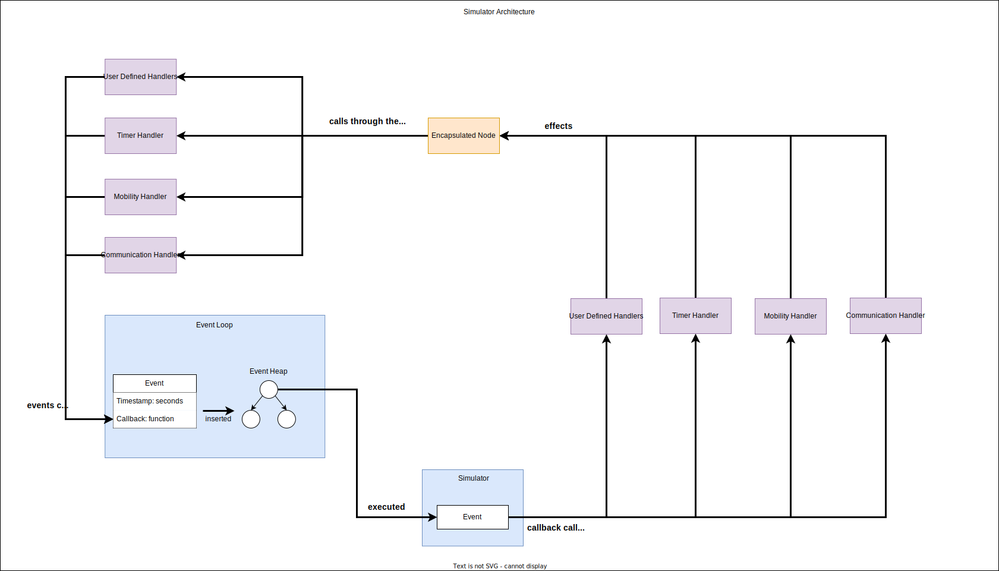

# Introduction

The guides in this section will teach you to use the Python Simulator which is
part of the GrADyS-SIM NextGen framewok. Simulations ran in this mode are said
to be in prototype mode. 

## Why use the Python Simulator?
Use this simulator if you want quick iteration, easy setup, and a simple
interface. This simulator is great for testing out new ideas and quickly
prototyping new protocols. Don't let the word "prototype" fool you, this 
simulator is still very powerful and can be used to simulate any protocol that 
the other execution modes can. 

## How does it work?

The python simulator is an event-based simulator. This means that the simulator
will simulate through the execution of events. Events can be any action that
occurs in a specific timestamp. Events can represent messages being sent, 
node's positions being updated or anything else. 

The event-loop is basically a heap of these events, where the top of the heap
is the event that will be executed next, based on its timestamp. The simulator 
will execute the event by calling its callback method. For implementation 
details check out the [Event][event] section.

Every other component in the simulator is built on top of this event-based
architecture. The simulator is very modular and extensible, so you can easily
add new components to the simulator if you which to do it. The simulator is 
extended through the creation of handlers. Handlers are merely classes with a
reference to the event-loop and nodes in the simulation. They use these 
references to implement some functionality. Check out the 
[Handler](../../Modules/Simulator/handlers/index.md) section to learn more about handlers.

Protocols do not directly have access to any of the simulator's components. 
They indirectly interact with the simulator through the 
[python encapsulator][python].

## Important concepts

Before you start using the simulator you should understand the following
concepts:

- Event-loop: The event-loop is the central component of the simulator. It is
  responsible for executing events in the correct order. Check out the 
  [Event][event] section to learn more about events.
- Event: Events are the building blocks of the simulator. They represent
  actions that occur in a specific timestamp. Check out the [Event][event]
  section to learn more about events.
- Handler: Extensible interface to implement new functionality in the 
  simulator. Check out the [Handler](../../Modules/Simulator/handlers/index.md) section to 
  learn more about handlers.

## Architecture

