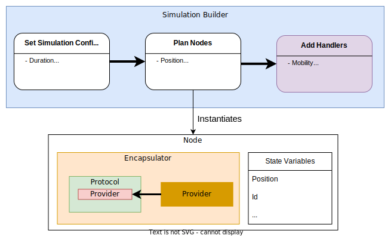

# Simulation
This page will go into details you the classes used to build and run a python
simulation.

## Building the simulation

The preferred method of creating a python simulation is making use of the 
[SimulationBuilder][gradysim.simulator.simulation.SimulationBuilder] class that provides 
an API that helps you build your simulation scenario and properly instantiates 
the [Simulator][gradysim.simulator.simulation.Simulator] class. A
[SimulationConfiguration][gradysim.simulator.simulation.SimulationConfiguration] is 
passed to the builder during initialization for simulation-level configuration. 

To help you with positioning your nodes some utility methods are also provided.

:::gradysim.simulator.simulation.SimulationConfiguration
    options:
        heading_level: 3

:::gradysim.simulator.simulation.PositionScheme
    options:
        heading_level: 3

:::gradysim.simulator.simulation.SimulationBuilder
    options:
        heading_level: 3

## Running the simulation

After calling the 
[SimulationBuilder.build()][gradysim.simulator.simulation.SimulationBuilder.build] method 
you will get a Simulator instance. This instance has already been pre-baked with 
all the nodes and handlers you configured using your builder. This class will 
manage your simulation which can be started by calling the 
[start_simulation()][gradysim.simulator.simulation.Simulator.start_simulation]
method. That's the only [Simulator][gradysim.simulator.simulation.Simulator] method a user 
has to interact with.

The python simulation has the following overall architecture (open in a new tab
if you want to take a closer look):

The simulation will run until either no more events exist or one of the 
termination conditions set in [SimulationConfiguration][gradysim.simulator.simulation.SimulationConfiguration] 
are fired. To better understand the simulation you can check how the
[EventLoop][gradysim.simulator.event.EventLoop] works.

:::gradysim.simulator.simulation.Simulator
    options:
        heading_level: 3