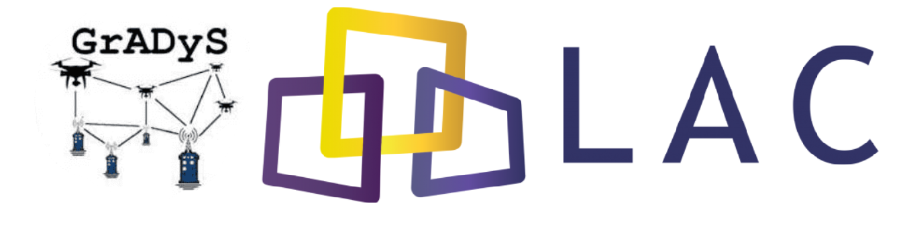

# Introduction

## What is GrADyS-SIM TNG?

GrADyS-SIM TNG is a network simulation framework. You can use this software
to create simulations capable of representing scenarios populated by network
nodes that coexist in a simulated environment and can send messages to each 
other. The primary focuses of the simulator are usability and flexibility.  

Usability is achieved by opting for a simple-to-use python simulation API 
that allows you to quickly build and prototype decentralized algorithms in 
a network simulation environment. Flexibility is achieved by enabling the 
user to reuse his algorithm implementations on a more realistic network 
simulation scenario by integrating with OMNeT++ and, in the future, even 
reuse his algorithms in the real world through a MAVLINK integration.

The framework was created to be used in three main ways: **prototype mode**,
**integrated mode** and **experiment mode**. As mentioned one of the main
features of this framework is that you can use the exact same implemented
logic on all three modes, without changing a line of code. You can understand
more about these modes in the execution mode documentation [here][execution-modes].

What's being executed in these three modes is a central piece of code called
**protocols**. Protocols are user-defined classes that implement some kind of
logic, they dictate the behaviour of a **simulation node**. A simulation node
is an entity that exists within the simulation environment. It interacts with
the environment through movement and with other nodes through network communication.

The way protocols are build they can interact with the environment without
being dependent on a specific environment implementation. They observe and
act through interfaces provided to them during execution in a technique
commonly called dependency injection. What this means is that you can re-utilize
that same code in completely different environments as long as someone has done
the work of integrating that environment with the interfaces that the protocol
expects. GrADyS-SIM TNG provides integrations to three environment types which
are the previously mentioned modes.

## Why does GrADyS-SIM TNG exist?

{ align=center }

[GrADyS](https://www.lac.inf.puc-rio.br/index.php/gradys/) is a project member of 
a laboratory called [LAC](https://www.lac.inf.puc-rio.br/) from PUC-Rio university. 
Our main work is focused on exploring the coordination of autonomous vehicles through 
descentralized algorithms.

We created GrADyS-SIM to enable us to test our algorithms in a controlled, cheap and
fast environment. Field tests are expensive and consume large amounts of time. Having
a simulation environment helps us understand and validate things before we take them
to the field.

GrADyS-SIM was created first and foremost to serve as a tool for the GrADyS project. As
we developed it we noticed that this could be a very useful tool not only for us but for
the scientific community in general. 

GrADyS-SIM runs in the [OMNeT++](https://omnetpp.org/) which is an event-based 
network simulator that enabled us to quickly model very complex network architectures 
and test the effects ofdifferent scenarios, network protocols and components on our 
algorithms. OMNeT++ although stillvery useful has a very steep learning curve, even 
setting it up is a very involved process thatrequires specific setups to get it working 
perfectly. Even for the people inside our project it is cumbersome to work with so we 
concluded that some new tool needed to be built to remedy this.

GrADyS-SIM-TNG was envisoned as a low-dependency, light and easy to use simulator that
would not substitute OMNeT++ but fill the niche of being a tool for quick prototyping 
before more realistic results would be collected from OMNeT++. An issue we already had
was translating results from the OMNeT++ simulation to the real world. Introducing a 
new link in this chain would only make this disconnect between our imlpementation
environments greather, so GrADyS-SIM TNG would need to somehow generate code that could
be run everywhere, in python, OMNeT++ and the real world. 

These were our motivations to create this tool. We are also taking extra care to make
sure this won't be a tool only for the GrADyS project, but for anyone with similar
interests to ours. This means creating a very general implementation that can be 
used to implement all kinds of different ideas, instead of something focused only
on our area of research.

